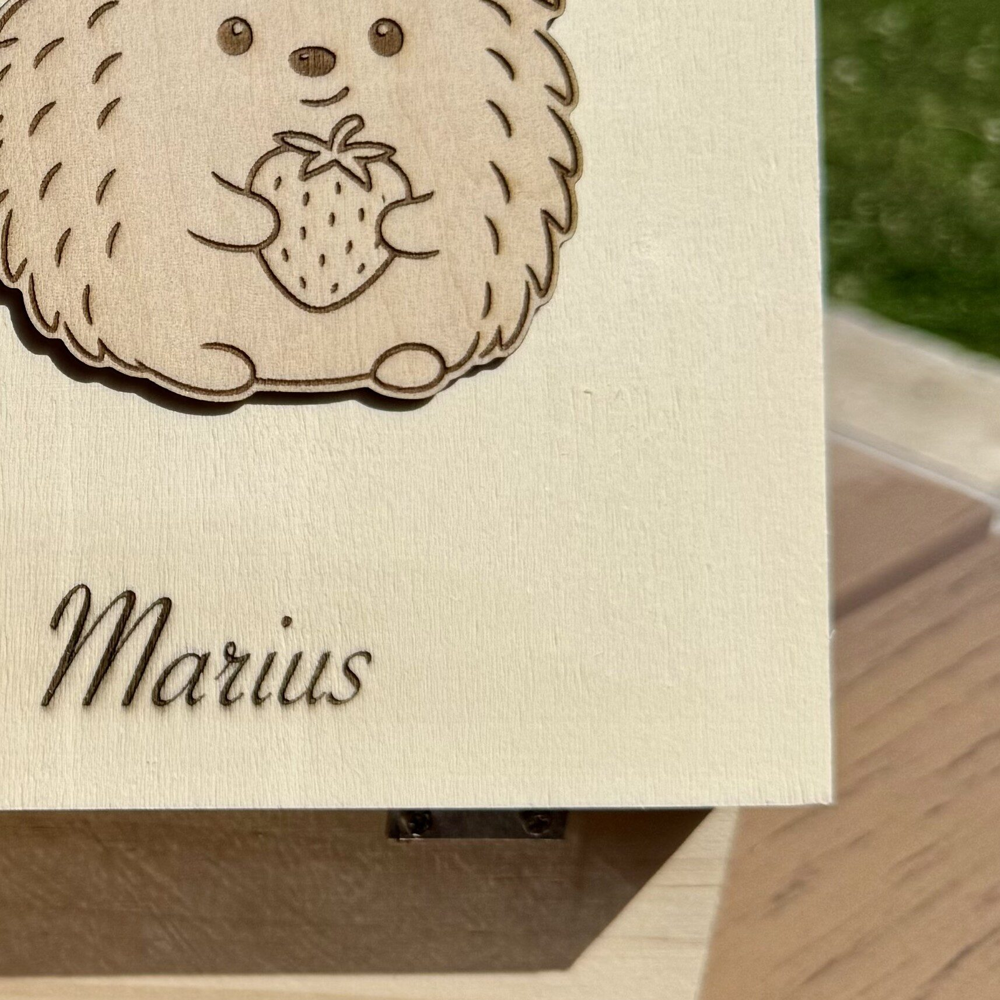

# Guide : modifier le site toi-même

Ce guide t'explique comment changer un texte, un prix, une photo, ou ajouter un nouveau produit — **sans avoir besoin de coder**. Il te faut juste :
- Le dossier complet du site (toutes les pages + `style.css` + les photos), toujours ensemble
- Un simple éditeur de texte (le Bloc-notes sur Windows, TextEdit sur Mac — ouvre le fichier `.html` avec "Ouvrir avec" → éditeur de texte, pas ton navigateur)

---

## ✏️ Modifier un texte

1. Ouvre le fichier de la page concernée (ex. `naissance-valises.html`) avec un éditeur de texte
2. Utilise **Ctrl+F** (ou Cmd+F sur Mac) pour rechercher un bout du texte que tu veux changer (ex. "Bien plus qu'une valise")
3. Le texte est toujours entre deux balises, par exemple :
   ```
   <h1>Bien plus qu'une valise de naissance...</h1>
   ```
   Tu changes uniquement ce qui est **entre** les balises `<h1>` et `</h1>` — ne touche pas aux balises elles-mêmes (les mots entre `<` et `>`)
4. Enregistre le fichier (Ctrl+S), en gardant le format `.html`

## 💰 Modifier un prix

Les prix sont écrits en texte simple dans les pages, par exemple :
```
<div class="prod-price">20€</div>
```
Cherche le prix avec Ctrl+F (ex. "20€"), remplace uniquement le chiffre, enregistre.

## 📸 Remplacer une photo

C'est le plus simple :
1. Prépare ta nouvelle photo (recadrée comme tu veux)
2. Renomme-la **exactement comme l'ancienne** (ex. `theme-herisson.jpg`)
3. Remplace le fichier dans le dossier du site
4. C'est tout — aucune ligne de code à toucher, la page affiche automatiquement la nouvelle photo

⚠️ Si tu donnes un nom différent à ta photo, il faudra aussi changer son nom dans le fichier HTML (cherche l'ancien nom avec Ctrl+F et remplace-le par le nouveau).

## 🖼️ Ajouter un nouveau produit dans une galerie

1. Ouvre la page de la sous-catégorie concernée
2. Repère un bloc "carte produit" ou "thème" déjà existant, par exemple :
   ```html
   <div class="theme-card reveal">
     <div class="ph"></div>
     <h4>Thème hérisson</h4>
   </div>
   ```
3. **Sélectionne tout ce bloc** (du premier `<div` au `</div>` correspondant), copie-le (Ctrl+C), colle-le juste après (Ctrl+V)
4. Dans la copie, change juste le nom de la photo et le texte
5. Enregistre

C'est le principe du copier-coller : un produit = un bloc que tu dupliques et adaptes.

## 🧭 Les règles d'or

- **Ne supprime jamais** un signe `<`, `>`, ou `"` — ce sont des repères techniques, si un seul disparaît la page peut ne plus s'afficher correctement
- Si un doute : fais une **copie de sauvegarde** du fichier avant de le modifier (renomme-la par exemple `naissance-valises-avant.html`), pour pouvoir revenir en arrière facilement
- Toujours garder tous les fichiers (pages, `style.css`, photos) **dans le même dossier**

## 🤝 Et si tu bloques ?

Rien de grave — reviens me voir ici avec le fichier et je corrige ou je t'explique. Ce guide est là pour les modifications simples et rapides ; pour toute nouvelle sous-catégorie ou refonte plus large, on continue à travailler ensemble comme avant.
